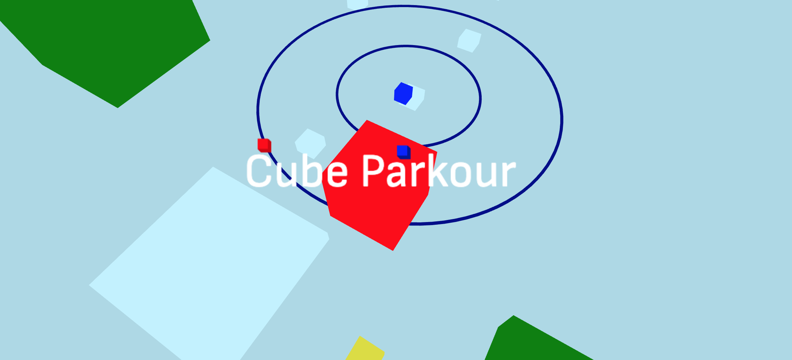

This is a reupload of a game I made in 2022 which I posted on replit (when it wasn't an AI platform), receving 2K runs, 57 likes and 100 leaderboard entries.

## Original Description

Cube Parkour is a 3D third-person platformer built with three.js.

**Controls:**
* Mouse to look around
* WASD/Arrow keys to move
* Space to jump
* Esc to pause

**Hints:**
* Level 1: Don't fall off. If this is hard, try to get to the edge of platform before jumping
* Level 2: Jump over enemies and hide around walls to avoid them
* Level 3: Wait for the perfect opportunity before making your jump. At the end, trap the enemies in the pit, and jump off the side to land on the first platform
* Level 4: Move slowly unless being chased. Take some time to think about the puzzle before you try it. Also, try increasing your screen brightness
* Level 5: Run away from the boss and jump over the waves (sometimes you need to jump over two). Do the parkour, then watch the boss sink into lava
* Level 6: Watch the skies for both falling enemies and platforms

**Cheats:**
* `Alt+F+4` to skip level (`Alt+4+F` on ms edge). Not to be confused with `Alt+F4`. Or just skip from the menu but this method is funny.